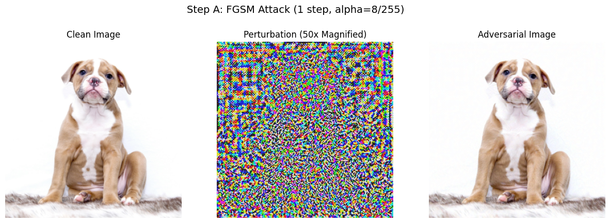
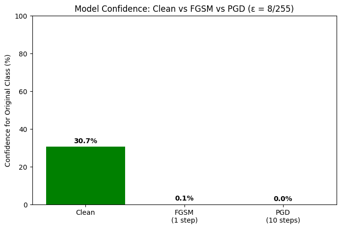

# 🔐 AI Security — Adversarial Attack Experiments

## About This Repository
A collection of hands-on experiments exploring how AI systems can be attacked
and defended. Each experiment dives into real adversarial techniques using
deep learning models, demonstrating vulnerabilities and testing robustness.

## 📂 Experiments

| # | Topic | Status |
|---|-------|--------|
| 1 | PGD vs FGSM Adversarial Attack Simulation | ✅ Complete |

## 🚀 How to Run
1. Click on any `.ipynb` file
2. Click the **"Open in Colab"** badge at the top of the notebook
3. In Colab, go to **Runtime → Change runtime type → GPU**
4. Run all cells in order from top to bottom

## 🛠 Tools & Technologies
- Python 3
- PyTorch
- Google Colab (GPU)
- Inception v3 (Pre-trained on ImageNet)

## 📖 Experiment 1: The Robustness Stress Test
**Goal:** Compare a one-step adversarial attack (FGSM) vs a multi-step attack (PGD)
on a pre-trained Inception v3 model using the same perturbation budget (ε = 8/255).

**Key Findings:**
- FGSM (1 step) reduced model confidence from 30.66% to 0.08%
- PGD (10 steps) reduced model confidence from 30.66% to 0.00%
- Same budget, but PGD is far more destructive
- PGD perturbation appears more structured than FGSM noise
  
### Results
#### Step A (FGSM) vs Step B (PGD) — Clean, Perturbation & Adversarial Images

#### Confidence Comparison

## 👤 Author
**ALINGILYA CRISPIN NJEWA** — Passionate about AI Security and Cybersecurity

## 📝 License
This repository is for educational purposes only.
